# Machine Learning Engineer Nanodegree
## Capstone Project
Sohaib Zafar  
April 28, 2020

## I. Definition

### Project Overview

In partnership with Bertelsmann Arvato, this project is part of the Udacity Machine Learning Engineer Nanodegree Capstone Project. For Arvato Financial Solutions, the main goal of this project is to build a Customer Segmentation Report.

Arvato offered demographic data on the general population of Germany as well as current mail-order customers (such as age, wages, wealth, education, properties, vehicles, homes, families, and so on). Under Arvato's terms and conditions, the data is secure and not accessible to the general public.

This demographic data will be used to classify mail-order company consumer segments in order to optimize targeted marketing efforts and forecast new customer conversion.

### Problem Statement

This challenge is a real-life problem, provided by Arvato Financial Solutions, where the problem statement is:

***How can their client, a mail-order company, gets new clients efficiently using data-driven approach for targeted marketing?***

Customer Segmentation is performed using ML unsupervised learning techniques to classify the clusters of the population that best represent the company's core customer base.

After assessing the core customer base, marketing campaign data was used to apply ML supervised learning techniques to predict people who are likely to become new customers.

### Metrics

Since this is a multi-class classification issue, the main metric to measure model output is the Area Under the Curve Receiver Operating Characteristics (ROC-AUC). The curve represents a measure of separability, with a higher score indicating better model efficiency. ROC-AUC protects against class imbalance, which is important in this case. The number of positive responses to an ad campaign is usually much lower than the number of negative responders. This is also the Kaggle submission's needed evaluation metric.

## II. Analysis

### Data Exploration

There are four data files associated with this project:

-   `Udacity_AZDIAS_052018.csv`: Demographics data for the general population of Germany; 891 211 persons (rows) x 366 features (columns).
-   `Udacity_CUSTOMERS_052018.csv`: Demographics data for customers of a mail-order company; 191 652 persons (rows) x 369 features (columns).
-   `Udacity_MAILOUT_052018_TRAIN.csv`: Demographics data for individuals who were targets of a marketing campaign; 42 982 persons (rows) x 367 (columns).
-   `Udacity_MAILOUT_052018_TEST.csv`: Demographics data for individuals who were targets of a marketing campaign; 42 833 persons (rows) x 366 (columns).
-   `DIAS_Attributes_Values_2017.xlsx`: Values- level iInformation about attributes used in data.
-   `DIAS_Information_Levels_Attributes_2017_Komplett.xlsx`: Top-level information about attributes used in data.

There are a number of missing values in these datasets, and not all of the features in a given Excel spreadsheet have a description, which needs to be discussed. Arvato presented a top-level list of attributes and descriptions, as well as a thorough mapping of data values for each element, in two spreadsheets.

### Algorithms and Techniques

For dimensionality reduction in the Unsupervised Learning approach, I'll use the Principal Component Analysis algorithm. PCA allows for the decomposition and transformation of data into the most relevant component, based on the principle that the more variance a function has, the greater the data's understanding ability.
Following the dimensionality reduction, As a clustering process, I will use K-means. Customer segmentation is the process of dividing a customer base into groups of people that have similar characteristics. K-means is a simple approach that works well for this issue since it scales well to large datasets.
The K-means implementation theory is very simple:
1.  Clusters the data into _k_ groups where optimal _k_  is selected using elbow method.
2.  Select _k_ points at random as cluster centers.
3.  Assign objects to their closest cluster center according to the  _Euclidean distance_  function.
4.  Calculate the centroid or mean of all objects in each cluster.
5.  Repeat steps 2, 3 and 4 until the same points are assigned to each cluster in consecutive rounds.

A fundamental step for any unsupervised algorithm is to determine the optimal number of clusters into which the data may be clustered. The **Elbow Method** is one of the most popular methods to determine this optimal value of k.
The **elbow method** runs **k**-**means** clustering on the dataset for a range of values for **k** (say from 1-10) and then for each value of **k** computes an average score for all clusters. By default, the distortion score is computed, the sum of square distances (SSE) from each point to its assigned center. When plotted, the graph resembles an elbow. As the k rises, the elbow point reflects the point of diminishing returns.
For prediction, I'll use the Supervised learning method after evaluating the customer segmentation. For the Supervised section of this study, I chose to evaluate different models mentioned below for the best results.
 
- Logistic Regression is a classification algorithm used to predict the probability of a target variable.
- Random Forest Classifier operates by constructing a multitude of decision trees at training time and outputting the class that is the mode of the classes.
- A multilayer perceptron (MLP) is a class of feedforward artificial neural network (ANN). It utilizes a supervised learning technique called backpropagation for training.
- Gradient Boosting Classifier produces a prediction model in the form of an ensemble of weak prediction models, typically decision trees.
- LightGBM is a fast, distributed, high performance gradient boosting framework based on decision tree algorithms. It is fast because it uses leaf-wise learning rather than level-wise learning.
- XGBoost Classifier - follows the principle of gradient boosting. There are however, the difference in modeling details. Specifically, xgboost used a more regularized model formalization to control over-fitting, which gives it better performance.

### Benchmark

Before doing any hyper-parameter optimization, I created different basline models and performed cross-validation and take mean score as a benchmark, before final model selection and paramter tuning.

## III. Methodology

### Data Preprocessing

After loading the customers and general population data first thing I noticed that there were 3 columns in cutomer data more than the general population data. So I dropped them right away. Secondly I also dropped the LNR id column from both datasets.

I observed that not only there were a lot of missing values in the data, but also there were *unknown* values like [-1, 0, -9] which I decided to convert to np.nan as well. Th find which values should be considered as *unknown* I refered to the "DIAS Attributes - Values 2017.xlsx" column *Meaning* and search for the correspoding values for the *unknown* and replaced with np.nan.

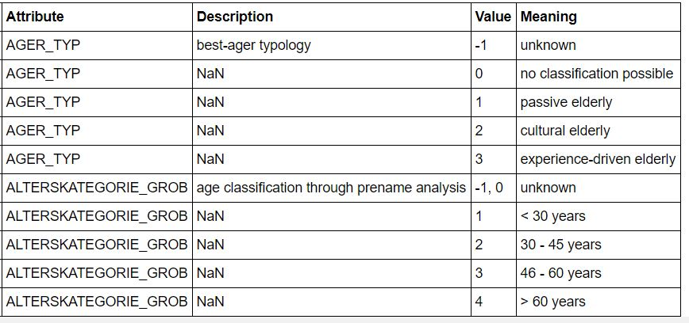

There were some special characters like ['X', 'XX', '', ' '] which i decided to convert to np.nan as well.

Now after cleaning we have even more missing values in the two datasets so I decided to plot the percentage of missing values in both.

Customers:
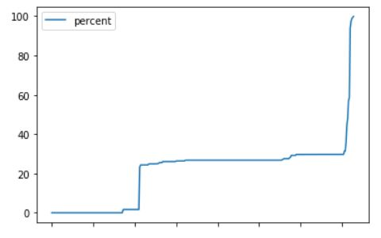

General:
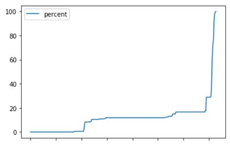

I decided to drop some more columns from both datasets where the percentage of missing values is high. 30-32% seemed to be a good choice.

### Feature Engineering
Below are some Feature Encoding and Engineering performed. 

-  'CAMEO_DEU_2015' and 'D19_LETZTER_KAUF_BRANCHE' are categorical features that contains a lot of values ranging from A to F and 1 to 9. Label Encoding was used to encode categories to integers. (One-Hot encoding would have been a better choice in terms of accuracy but a bad choice in terms of memory because there are too many unique values).
-  ‘OST_WEST_KZ’ is a binary categorical feature that had the values array ['W', 'O'], which I mapped to: {'W':0, 'O':1} 
- The data type of 'CAMEO_DEUG_2015' was converted to float.
- I splitted 'CAMEO_INTL_2015' feature into 2 new features FAMILY and WEALTH, and dropped the original.
- I used 'LP_LEBENSPHASE_FEIN' to create two new features, one related to life stage, it called it 'AGE' and one related to the income scale, I called it 'INCOME', and dropped the original.
- I splitted 'PRAEGENDE_JUGENDJAHRE' into 2 different features, ‘DECADE’ feature and a type of ‘MOVEMENT’ feature (avant-garde or not), and then dropped the original.
- ‘EINGEFUEGT_AM’ is a feature related to time, so converted it to a datetime object and extracted the year named as 'EINGEFUEGT_YEAR''. 

There are still missing values in the data that needs to be imputed. I used SimpleImputer() method to impute the nans with the most-frequent values.

### PCA - Dimensionality Reduction 
The model becomes more complex as the number of features or dimensions increases, increasing the likelihood of overfitting. A model trained on a large number of features typically generates predictions that are far more dependent on the data on which it was trained, resulting in overfitting and not performing well on general data.
It's critical to reduce dimensionality in order to improve a model's computational efficiency and memory usage, as well as to improve performance and reduce feature noise. Principal component analysis (PCA) is the most common linear technique for dimensionality reduction. It involves mapping data to a lower-dimensional space in such a way that the variance of the data in the low-dimensional representation is maximized.   Following plot is used to decide on how many components, that accounted for around 80% of the variance observed.

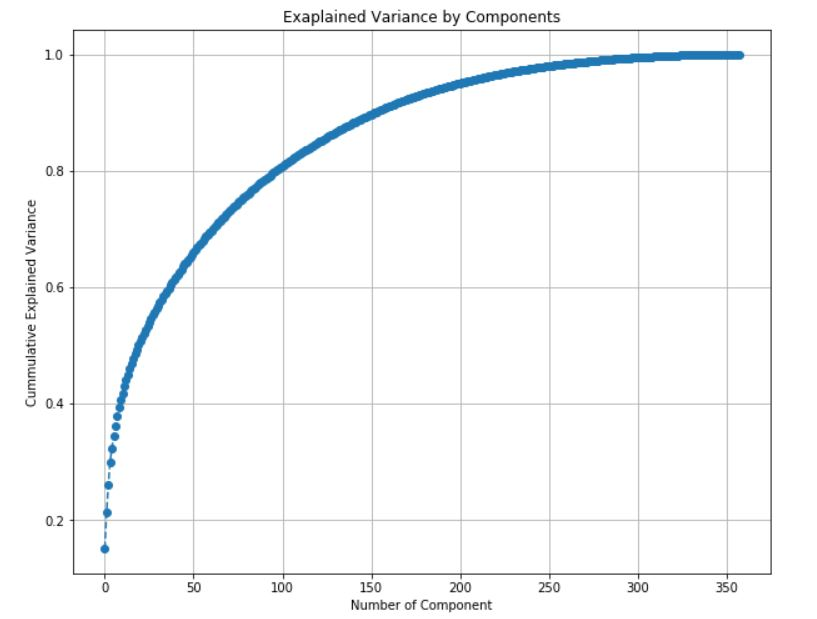

### Component Makeup
Below is break-down of how the first 3 priciple component feature make-up looks like:

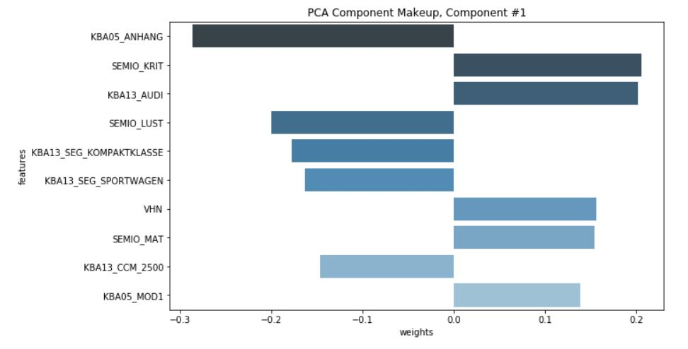
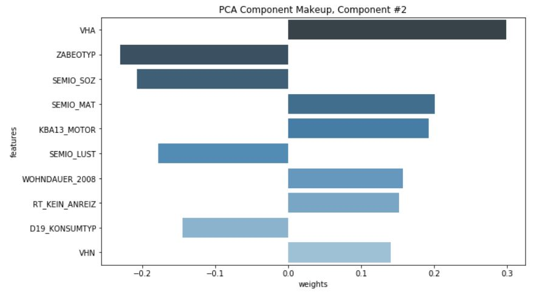
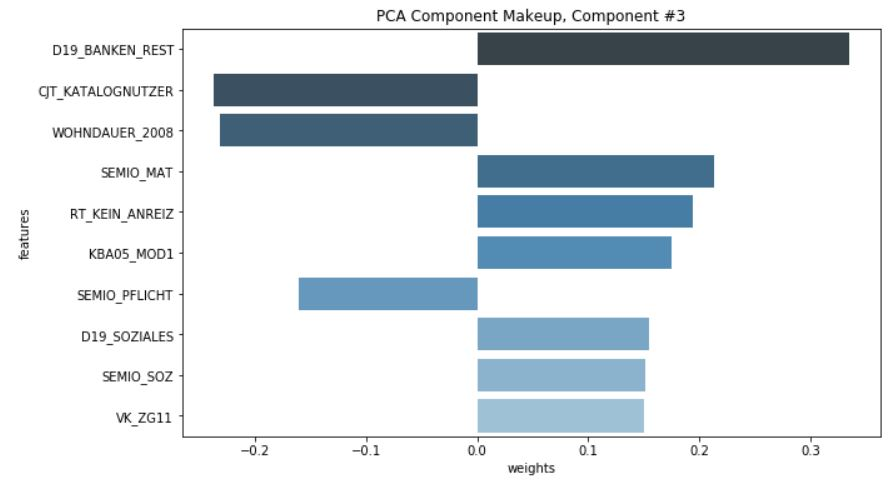

### Unsupervised Learning for Customer Segmentation
After scaling the data with minmax scalar, I decided to keep 150 components as per PCA. K-means is used to construct clusters of similar data.
We must first specify the number of centroids, which is denoted by the letter k in Kmeans. To find the best value for k, I'll use the Elbow approach. The Elbow method compares the number of squared errors until no further change is seen.
This k value is visible in the graph, where the graph descends become gradual.
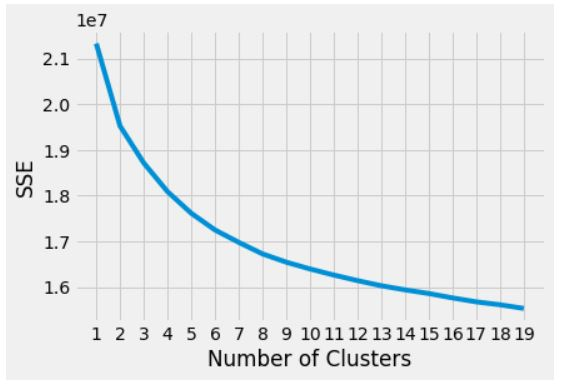
The graph above suggests that the best value for k is 6. I used *KneeLocator()* method from *kneed* python pacakge to confirm the optimal elbow point of 6.

I can see certain clusters that are more in proportion to customers than the general population with K means fitted to 6 clusters. 
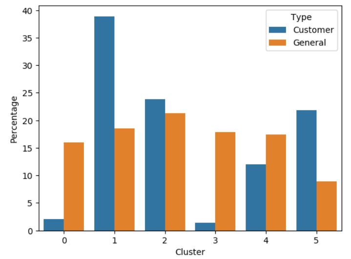
Using six clusters for my research, I discovered that clusters 1, 2, 4, and 5 seem to have the characteristics that define what a core customer is, while clusters 0 and 3 round up the characteristics that define who the core customers are not.

### Supervised Learning Modeling for Prediction

After loading the training data, i observed that there is class imbalance. Therefore the ROC-AUC will be chosen as an evaluation metrics for all the different classifiers described in the previous section. Following methods are available for different classifiers:
 
 - LogisticRegression – for Logistic Regression Classification
 - RandomForestClassifier - for Random Forest Classification
 - MLPClassifier – for multilayer perceptron
 - GradientBoostingClassifier - for gradient boosting model
 -  LGBMClassifier - for Light GBM Classifier
- XGBClassifier - for XGBoost Classifier

Below you can see how well they perform in comparison
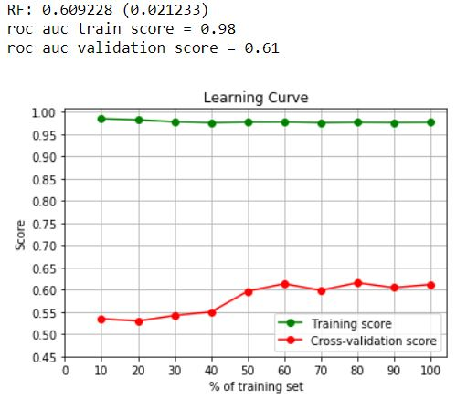  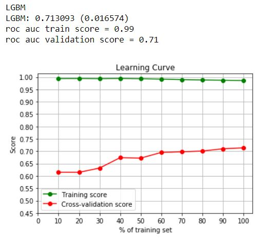 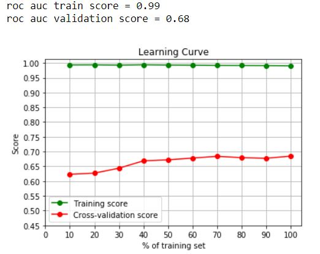

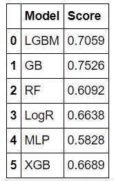
As you can see the LGBM, Gradient Boosting (GB) and XGB seems to be performing well for unscaled data. But the training time of LGBM is much lower than Gradient Boosting or XGB. So LGBM seems to be a good choice in terms of accuracy, speed and resources.

Lets also look how the models perform for Standard Scaler
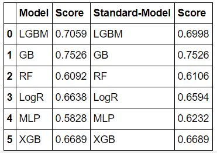
Let us see how model perform after data normalization with Minmax.

Since min max scaler seems to perform better than standard scalar across all models.  I will choose this. LGBM and GB are selected for testing and tuning further. 

I chose the Bayesian optimization method for tuning because it is considered to be one of the most effective approaches. The hyperparameter tuning procedure for LGBM and GB is shown below.

#### LGBM Hyperparameter 
Below are the best performing model hyperparameter found after using BayesSearch CV with 300 iterations.

LGBMClassifier(application='binary', learning_rate=0.2952150312099677,
               max_bin=1579, max_depth=2, metric='auc', min_child_samples=50,
               n_estimators=20, num_leaves=114, reg_alpha=1.0,
               reg_lambda=6.087536046756808e-07, scale_pos_weight=1,
               verbose=-1)

#### GB Hyperparameter 
Below are the best performing model hyperparameter found after using BayesSearch CV with 50 iterations (the number is low because GB training is very time consuming).

GradientBoostingClassifier(learning_rate=0.001, max_depth=6, max_features=30,
                           min_samples_leaf=10, n_estimators=2000,
                           subsample=0.7195263583720765)
                           
I will generate predictions using both models and then decide which model performs better.

## IV. Results
The Best AUC Score of **0.80420** was achieved with LGBM model after uploading the prediction to Kaggle Competition. Results can be found on Kaggle official website where currently my submission ranks 52 out of 364 participant
[https://www.kaggle.com/c/udacity-arvato-identify-customers/leaderboard](https://www.kaggle.com/c/udacity-arvato-identify-customers/leaderboard) 

## IV. Improvement

As part of my jouney following ideas could be explored to possibly improve model prediction 

-   Doing better feature engineering and feature selection by gathering more domain knowledge in understanding the features better.
-   Using bigger training set by also including the data used for customer segmentation.
-   Increasing the number of iterations in the hyper-parameter tuning step.
-   Increasing the number of PCA principle-components and number of iterations for K-Means clustering, can give better data variance coverage and clustering, hence improving customer-cluster mapping, which could be used as a feature for supervised learning model.