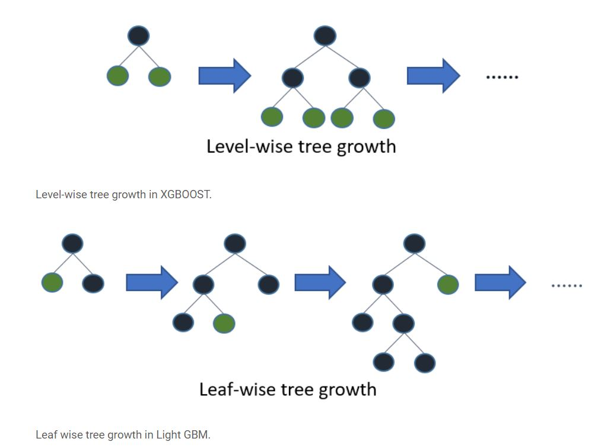
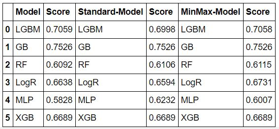

# Machine Learning Engineer Nanodegree
## Capstone Project
Sohaib Zafar  
April 28, 2020

## I. Definition

### Project Overview

In partnership with Bertelsmann Arvato, this project is part of the Udacity Machine Learning Engineer Nanodegree Capstone Project. For Arvato Financial Solutions, the main goal of this project is to build a Customer Segmentation Report.

Arvato offered demographic data on the general population of Germany as well as current mail-order customers (such as age, wages, wealth, education, properties, vehicles, homes, families, and so on). Under Arvato's terms and conditions, the data is secure and not accessible to the general public.

This demographic data will be used to classify mail-order company consumer segments in order to optimize targeted marketing efforts and forecast new customer conversion.

### Problem Statement

This challenge is a real-life problem, provided by Arvato Financial Solutions, where the problem statement is:

***How can their client, a mail-order company, gets new clients efficiently using data-driven approach for targeted marketing?***

Customer Segmentation is performed using ML unsupervised learning techniques to classify the clusters of the population that best represent the company's core customer base.

After assessing the core customer base, marketing campaign data was used to apply ML supervised learning techniques to predict people who are likely to become new customers.

### Metrics

Since this is a multi-class classification issue, the main metric to measure model output is the Area Under the Curve Receiver Operating Characteristics (ROC-AUC). The curve represents a measure of separability, with a higher score indicating better model efficiency. ROC-AUC protects against class imbalance, which is important in this case. The number of positive responses to an ad campaign is usually much lower than the number of negative responders. This is also the Kaggle submission's needed evaluation metric.

## II. Analysis

### Data Exploration

There are four data files associated with this project:

-   `Udacity_AZDIAS_052018.csv`: Demographics data for the general population of Germany; 891 211 persons (rows) x 366 features (columns).
-   `Udacity_CUSTOMERS_052018.csv`: Demographics data for customers of a mail-order company; 191 652 persons (rows) x 369 features (columns).
-   `Udacity_MAILOUT_052018_TRAIN.csv`: Demographics data for individuals who were targets of a marketing campaign; 42 982 persons (rows) x 367 (columns).
-   `Udacity_MAILOUT_052018_TEST.csv`: Demographics data for individuals who were targets of a marketing campaign; 42 833 persons (rows) x 366 (columns).
-   `DIAS_Attributes_Values_2017.xlsx`: Values- level iInformation about attributes used in data.
-   `DIAS_Information_Levels_Attributes_2017_Komplett.xlsx`: Top-level information about attributes used in data.

There are a number of missing values in these datasets, and not all of the features in a given Excel spreadsheet have a description, which needs to be discussed. Arvato presented a top-level list of attributes and descriptions, as well as a thorough mapping of data values for each element, in two spreadsheets.

### Algorithms and Techniques

For dimensionality reduction in the Unsupervised Learning approach, I'll use the Principal Component Analysis algorithm. PCA allows for the decomposition and transformation of data into the most relevant component, based on the principle that the more variance a function has, the greater the data's understanding ability.
Following the dimensionality reduction, As a clustering process, I will use K-means. Customer segmentation is the process of dividing a customer base into groups of people that have similar characteristics. K-means is a simple approach that works well for this issue since it scales well to large datasets.
The K-means implementation theory is very simple:
1.  Clusters the data into _k_ groups where optimal _k_  is selected using elbow method.
2.  Select _k_ points at random as cluster centers.
3.  Assign objects to their closest cluster center according to the  _Euclidean distance_  function.
4.  Calculate the centroid or mean of all objects in each cluster.
5.  Repeat steps 2, 3 and 4 until the same points are assigned to each cluster in consecutive rounds.

A fundamental step for any unsupervised algorithm is to determine the optimal number of clusters into which the data may be clustered. The **Elbow Method** is one of the most popular methods to determine this optimal value of k.
The **elbow method** runs **k**-**means** clustering on the dataset for a range of values for **k** (say from 1-10) and then for each value of **k** computes an average score for all clusters. By default, the distortion score is computed, the sum of square distances (SSE) from each point to its assigned center. When plotted, the graph resembles an elbow. As the k rises, the elbow point reflects the point of diminishing returns.
For prediction, I'll use the Supervised learning method after evaluating the customer segmentation. For the Supervised section of this study, I chose to evaluate different models mentioned below for the best results.
 
- Logistic Regression is a classification algorithm used to predict the probability of a target variable.
- Random Forest Classifier operates by constructing a multitude of decision trees at training time and outputting the class that is the mode of the classes.
- A multilayer perceptron (MLP) is a class of feedforward artificial neural network (ANN). It utilizes a supervised learning technique called backpropagation for training.
- Gradient Boosting Classifier produces a prediction model in the form of an ensemble of weak prediction models, typically decision trees.
- LightGBM is a fast, distributed, high performance gradient boosting framework based on decision tree algorithms. It is fast because it uses leaf-wise learning rather than level-wise learning.
- XGBoost Classifier - follows the principle of gradient boosting. There are however, the difference in modeling details. Specifically, xgboost used a more regularized model formalization to control over-fitting, which gives it better performance.

### Benchmark

Before doing any hyper-parameter optimization, I created different basline models and performed cross-validation and take mean score as a benchmark, before final model selection and paramter tuning.

